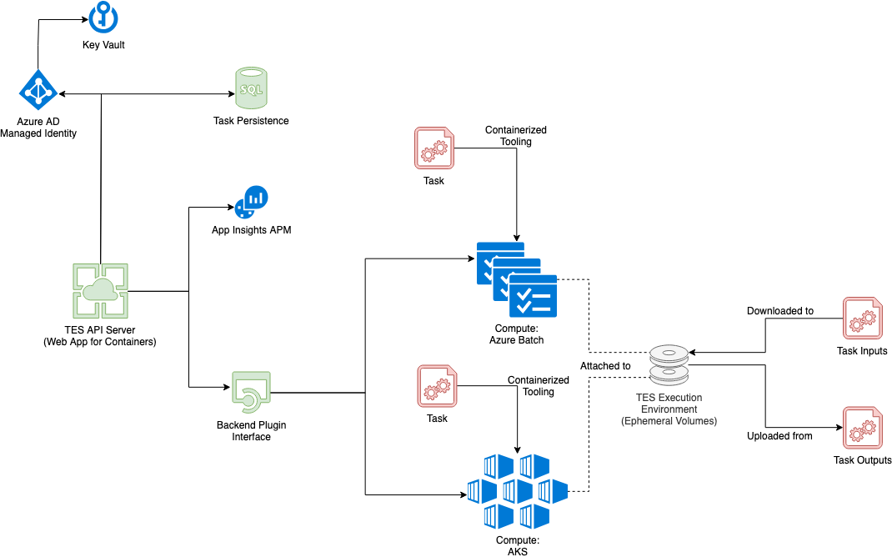
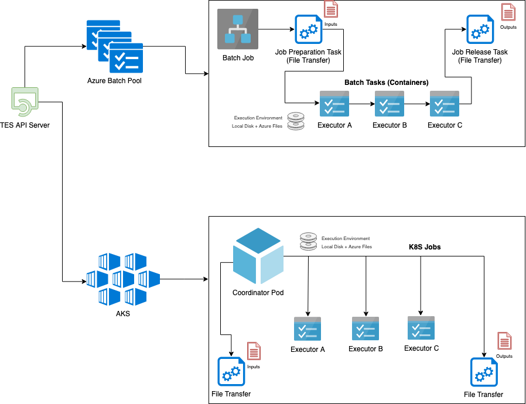

# Design documentation <!-- omit in toc -->
## Table of Contents <!-- omit in toc -->
<!--
Generated with the Markdown All in One extension by Yu Zhang.
https://marketplace.visualstudio.com/items?itemName=yzhang.markdown-all-in-one
-->
- [Context](#context)
  - [Project goals](#project-goals)
  - [Differentiation](#differentiation)
- [API Server](#api-server)
  - [Overview](#overview)
  - [Data models & database](#data-models--database)
  - [Logging](#logging)
  - [Backends - execution environment](#backends---execution-environment)
  - [Security](#security)
- [Backends - task execution](#backends---task-execution)
  - [Batch](#batch)
  - [AKS](#aks)
- [File transfer container](#file-transfer-container)
- [Use with workflow engines](#use-with-workflow-engines)
  - [Cromwell](#cromwell)
- [Known limitations](#known-limitations)

## Context
This document will provide an overview of the design decisions and solution architecture for the TES API server and related components. If you are looking for user or developer documentation on using and deploying the service please see the project-specific documentation linked to in the [main README](../README.md) file.

The diagrams shown below are sourced from the [Solution Architecture.html](Solution%20Architecture.html) document, which is a [draw.io](https://draw.io) diagram.

### Project goals
The solution aims to enable multiple workflow engines and tools to submit tasks against Azure cloud compute by implementing the vendor-agnostic GA4GH's TES API.

The API leverages a common backend interface so that additional Azure compute services can easily be added; Batch and AKS were planned initially, but more may follow.

### Differentiation
Why not leverage existing OSS tooling around TES? We wanted to provide a deeply integrated experience with Azure and leverage many of the platform features, and after examining existing tooling we felt it would be quickest and more suitable to build an Azure-native solution.

## API Server
### Overview
The API server is a Flask application whose job is simply to accept TES tasks, validate them, and then pass them on to the configure compute backend. It has a very small surface area, it exposes the GA4GH TES API (see its [swagger explorer](https://petstore.swagger.io/?url=https://raw.githubusercontent.com/ga4gh/task-execution-schemas/develop/openapi/task_execution.swagger.yaml)) plus a custom endpoint to facilitate provisioning.



### Data models & database
The in-memory TES data models are implemented as [marshmallow](https://marshmallow.readthedocs.io/en/3.0/) schemas, which provides easy (de)serialization to/from JSON. Those models are then persisted to the database using [SQLAlchemy](https://www.sqlalchemy.org/).

[Alembic](https://alembic.sqlalchemy.org/en/latest/) is used to revision the database, managed by [Flask-Migrate](https://flask-migrate.readthedocs.io/en/latest/).

A PostgreSQL database is used to keep track of active tasks and the compute backends are perodically queried via a Celery background task to update their status. Task status is also immediately refreshed when client requests a task's status.


### Logging
The standard Python `logging` module is used by the entire codebase, with [OpenCensus](https://opencensus.io/) is used to collect all application logs and send them to [Application Insights via a local forwarder](https://docs.microsoft.com/en-us/azure/azure-monitor/app/opencensus-python).


### Backends - execution environment
In order to ensure that TES Tasks do not need to be tailored for the Azure backend in use, a consistent execution environment is provided that is typically backed by a hybrid of cloud storage and local ephemeral disk.

* `/tes-wd`: An backend-specific volume mount, possibly only available to the specific executor
* `/tes-wd/shared`: A volume shared by all executors within a TES task
* `/tes-wd/shared-global`: A globally-shared volume for all TES tasks backed by Azure Files Standard (so expect ~60MB/s performance across files within folder)

TES inputs are marshalled to `/tes-wd/shared` before execution so inputs are shared among all executors in a single TES Task.

See the [usage documentation](USAGE.md) for details.

### Security
Any sensitive secrets (i.e. connection strings) are stored in Azure Key Vault instead of the Flask configuration's environment variables, although they may be provided via environment variables if you so please.

The endpoints exposed by the API support OAuth Bearer token validation so task visibility may be restricted between multiple users or tenants. Since most workflow engines assume trust and do not provide authentication, the default behavior is to disable the OAuth filters.

## Backends - task execution
A high-level overview of how TES tasks are mapped to Azure compute resources is shown below:


### Batch
The Batch backend has a higher lead time compared to AKS, but is easier to understand as it more closely resembles a local execution or a workflow running in an IaaS VM.

1. API server accepts the TES Task and a new pool is provisioned in the Azure Batch account using nodes with container support
2. A new Batch job is created with the `filetransfer` container scheduled as the preparation job to download the TES Inputs to each node's local disk
3. For each executor, a Batch task is created with the appropriate container and volume mappings so that the input files are exposed to the container
4. A release job executes the `filetransfer` container again to upload any applicable TES task outputs

### AKS
We have a proposed architecture for the backend execution, but it is not implemented yet.
1. A coordinator pod is deployed with rights to create k8s jobs
2. The coordinator creates a volume backed by Azure Managed Disks and schedules the `filetransfer` container as a job to download TES task inputs
3. For each executor, the coordinator serially schedules a job with the volume attached
4. The coordinator once again schedules a job with the `filetransfer` container to upload any TES task outputs
5. The coordinator pod is terminated

## File transfer container
The file transfer container (`containter-filetransfer` subfolder of this repo) contains a small Python script that leverages [pycosio](https://pycosio.readthedocs.io/en/stable/) to perform file I/O in a consistent manner across multiple against cloud.

This script is containerized and used to marshal the TES task input (downloads) and outputs (uploads). This approach was taken over platform-native approaches in Azure Batch or other backends in order to provide a consistent experience for TES input/output file management across backends - one that can be leveraged by Batch, AKS, etc.

## Use with workflow engines
While the API server exposes a TES-compatible API which can be called upon standalone, a typical real-world usage of the project will also include a workflow engine like Cromwell pointing to the TES API Server.

In order to enhance user experience, the API server introspects tasks in attempt to determine which workflow engine is submitting a task, and if successful, tags the detected properties about the workflow under a set of `ms-submitter` headers:
* `ms-submitter-name`: name of the workflow engine (e.g. `cromwell`)
* `ms-submitter-workflow-id`: Identifier across all TES tasks used by the submitter (e.g. Cromwell's workflow ID)
* `ms-submitter-workflow-name`: Human-readable name of the workflow used by the submitter (e.g. WDL workflow name)
* `ms-submitter-workflow-stage`: Stage of the workflow that the task represents (e.g. name of the call from WDL workflow file)

Once these tags are available, compute backends are able to customize behavior for different workflow engines as noted below.

### Cromwell
As of writing, the [Cromwell TES backend](https://cromwell.readthedocs.io/en/stable/backends/TES/) is limited to interacting with the local filesystem. As such, all generated TES inputs and outputs are local paths, for example:
```json
{
  ...
  "outputs": [
    {
      "name": "rc",
      "description": "MultiStep.Merge.rc",
      "url": "/tes-wd/shared-global/MultiStep/bded96bd-8d21-45c5-b956-2089ed4996ec/call-Merge/execution/rc",
      "content": null,
      "type": "FILE",
      "path": "/tes-wd/shared-global/MultiStep/bded96bd-8d21-45c5-b956-2089ed4996ec/call-Merge/execution/rc"
    },
    ...
  ]
  ...
}
```

Cromwell is considered the submitter when:
1. A task has an output ending with `execution/rc`, `execution/stdout` and `execution/stderr`
2. The `execition/rc` output's full path is of format `/tes-wd/.../{STRING}/{GUID}/call-{STRING}/execution/rc`
3. Task description is `:`-delimited and its first field is a GUID, and this GUID matches the GUID from the `exection/rc` output path

When Cromwell is detected, the TES input and output URL fields are mangled to use a blob SAS URI instead - see the Cromwell section in [USAGE](USAGE.md) for details.

A workaround is also implemented as certain inline WDL functions like `write_tsv()` in workflow calls are performed server-side before tasks are sent to the compute note, and the output file of the inline code executed by Cromwell is also not included in the task's inputs. Therefore any files that exist in the `execution` directory of a task that are not already TES task inputs are injected as TES task inputs.


## Known limitations
The following issues are known at this time and we would like to address them at a future date:
- AKS backend is not yet implemented
- Web UI is currently unused; eventually task status should be reported here
- File marshalling could be made more efficient to avoid redundant downloads
- The 'workdir' and 'stdin' parameters of TES tasks are ignored at the present time
